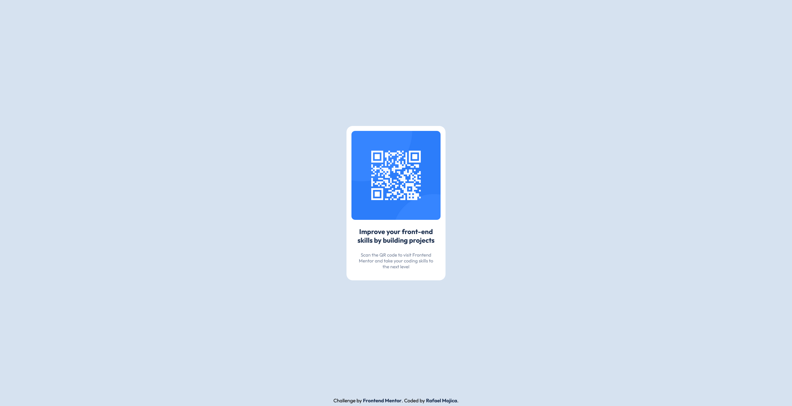

# Frontend Mentor - QR code component solution

This is a solution to the [QR code component challenge on Frontend Mentor](https://www.frontendmentor.io/challenges/qr-code-component-iux_sIO_H). Frontend Mentor challenges help you improve your coding skills by building realistic projects. 

## Table of contents

- [Overview](#overview)
  - [Screenshot](#screenshot)
  - [Links](#links)
- [My process](#my-process)
  - [Built with](#built-with)
  - [Continued development](#continued-development)
  - [Useful resources](#useful-resources)
- [Author](#author)

## Overview

### Screenshot

### Links

- Solution URL: [Add solution URL here](https://your-solution-url.com)
- Live Site URL: [Add live site URL here](https://your-live-site-url.com)

## My process

Since we're dealing with a color palette, I figured it would be easier to use [Sass](https://sass-lang.com/). I assigned each hex value to a variable so it's more readable.

- The first thing I worked on was the footer. Since I was given a starter HTML, I decided to keep some of the provided text. After aligning the text to the bottom of the page, I added a simple underline hover effect over the anchor tags.
- I started working on the QR code, my main hurdles were getting the right size and copying the design image perfectly by guessing the width and height of it.
- After a lot of trial and error, I was able to match the design image, only to find out that my QR code was shrinking and growing every time the window kept getting resized!
- To fix this, I just set a max-width to the parent.
- Lastly, I resized my footer on the mobile device so it looks better.
That's it!

### Built with

- Semantic HTML5 markup
- CSS custom properties
- Flexbox
- [Sass](https://sass-lang.com/) - CSS pre-processor

### Continued development

I would love to focus on using Sass and learning more about it because of the potential it packs. I would also love to learn about CSS grid as I only know Flexbox.

### Useful resources

- [Sass Crash Course](https://www.youtube.com/watch?v=nu5mdN2JIwM) - This video helped me understand everything I needed to know about Sass. Thank you Brad!

## Author

- Website - [Rafael Mojica](https://advanced-portfolio-six.vercel.app/)
- Frontend Mentor - [@rafmojica](https://www.frontendmentor.io/profile/rafmojica)
